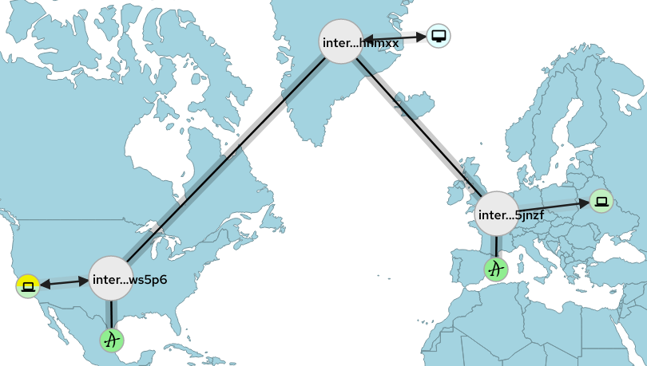
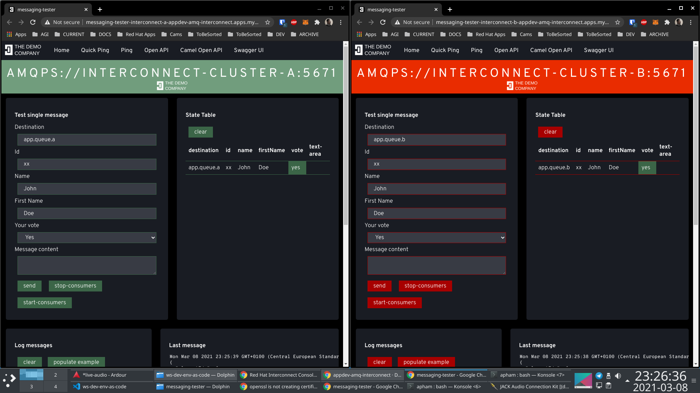

# TOC

- [TOC](#toc)
- [Prepare cluster](#prepare-cluster)
  - [Currently used versions](#currently-used-versions)
  - [User and password](#user-and-password)
- [Fuse](#fuse)
  - [Import images](#import-images)
- [AMQ Broker](#amq-broker)
  - [Import images](#import-images-1)
  - [Install hotfix](#install-hotfix)
- [Full Red Hat Interconnect/Red Hat AMQ Broker Mesh Demo](#full-red-hat-interconnectred-hat-amq-broker-mesh-demo)
  - [Deploy clusters of Brokers](#deploy-clusters-of-brokers)
    - [Deploy Cluster A](#deploy-cluster-a)
    - [Deploy Cluster B](#deploy-cluster-b)
  - [Deploy Interconnect Mesh](#deploy-interconnect-mesh)
    - [Deploy Interconnect Central Cluster](#deploy-interconnect-central-cluster)
    - [Deploy Interconnect A Cluster](#deploy-interconnect-a-cluster)
    - [Deploy Interconnect B Cluster](#deploy-interconnect-b-cluster)
  - [Deploy client demo apps](#deploy-client-demo-apps)
  - [Deploy some Monitoring](#deploy-some-monitoring)
- [AMQ Broker Federation](#amq-broker-federation)
  - [Setting up vars for custom federation coniguration](#setting-up-vars-for-custom-federation-coniguration)
  - [Creating keystores and truststores](#creating-keystores-and-truststores)
  - [Config generation](#config-generation)
  - [Create 2 Cluster in Federation](#create-2-cluster-in-federation)
- [AMQ Broker Cluster using stateful set only](#amq-broker-cluster-using-stateful-set-only)
  - [Self sign tls keys](#self-sign-tls-keys)
  - [Deploy main cluster](#deploy-main-cluster)
  - [Deploy second cluster](#deploy-second-cluster)
  - [(alternative) Using config generation](#alternative-using-config-generation)
- [AMQ Broker Cluster using operator](#amq-broker-cluster-using-operator)
  - [Self sign tls keys and import truststore](#self-sign-tls-keys-and-import-truststore)
  - [deploy main cluster](#deploy-main-cluster-1)
  - [deploy second cluster](#deploy-second-cluster-1)
- [Deploy Local Monitoring](#deploy-local-monitoring)
- [Install Interconnect](#install-interconnect)
  - [Notes](#notes)
  - [Self sign tls keys](#self-sign-tls-keys-1)
  - [Deploy central cluster](#deploy-central-cluster)
  - [Deploy main cluster](#deploy-main-cluster-2)
  - [Deploy second interconnect](#deploy-second-interconnect)
- [Deploy Messaging tester](#deploy-messaging-tester)
  - [Using openshift routes](#using-openshift-routes)
- [Kafka](#kafka)
  - [Intro](#intro)
    - [Custom Resource Definitions](#custom-resource-definitions)
    - [Cluster Operator](#cluster-operator)
    - [Topic Operator](#topic-operator)
    - [User Operator](#user-operator)
  - [Cluster creation](#cluster-creation)
  - [Kafdrop](#kafdrop)
  - [Mirror Maker](#mirror-maker)
  - [Creation and scaling of topics](#creation-and-scaling-of-topics)
  - [Deploy an consumer app](#deploy-an-consumer-app)
- [Change Data Capture](#change-data-capture)
- [Prometheus local](#prometheus-local)
- [Nexus](#nexus)


# Prepare cluster 

## Currently used versions
```
export fuse_app_template_version=2.1.0.fuse-sb2-7_10_0-00015-redhat-00001
export amq_broker_image_version=78-7.8-12
```

## User and password

Set your user token or credentials and login

```
export ocpuser="USR"
export ocppwd="PASSWORD"
export ocptoken="TOKEN"
export ocpurl="https://api.cluster-r7nwz.r7nwz.sandbox311.opentlc.com:6443"
```

```
oc login -u ${ocpuser} -p ${ocppwd} --server=${ocpurl}
```

```
oc login --token=${ocptoken} --server=${ocpurl}
```


# Fuse

## Import images
```
BASEURL=https://raw.githubusercontent.com/jboss-fuse/application-templates/application-templates-${fuse_app_template_version}
oc create -n openshift -f ${BASEURL}/fis-image-streams.json
oc replace -n openshift -f ${BASEURL}/fis-image-streams.json
```

# AMQ Broker

## Import images
```
oc replace -n openshift  -f https://raw.githubusercontent.com/jboss-container-images/jboss-amq-7-broker-openshift-image/amq-broker-78-dev/amq-broker-7-image-streams.yaml
oc create -n openshift -f https://raw.githubusercontent.com/jboss-container-images/jboss-amq-7-broker-openshift-image/amq-broker-78-dev/amq-broker-7-image-streams.yaml
```

## Install hotfix

Hotfix contains this [fix](https://github.com/alainpham/activemq-artemis/commit/e25fd3f64a95a5092b582c05f3e03486442df242) for federation connections

```
oc project openshift
oc new-build --strategy docker --binary -i amq-broker:7.8 --name amq-broker-hotfix
oc start-build amq-broker-hotfix --from-dir=amqbroker/hotfix/build --follow
```

# Full Red Hat Interconnect/Red Hat AMQ Broker Mesh Demo

The purpose of this section is to show quickly the benefits combining brokers and routers to build a multi environment, multi cloud, multi region Messaging Mesh.

The properties of this topology are

* Each region or environment can bring it's own broker and set of addresses and queues to the mesh dynamically.
* Able to provide location transparency for consumers and producers to the entire Mesh.

We will deploy of the following topology.

* One Central Red Hat Interconnect Router Cluster to serve as a hub for the Messaging Mesh
* All participants of the Mesh will have their own Interconnect Routers with attached Broker clusters
* All participants will connect to the central router and declare addresses and queues with linkRoutes or autoLinks.
* In this demo we show 2 partiticpants/regions/evironments



## Deploy clusters of Brokers

### Deploy Cluster A

```
oc create secret generic amq-broker-a-tls-secret \
--from-file=keystore.p12=amqbroker/tls/amq-broker-keystore.p12 \
--from-file=truststore.p12=amqbroker/tls/truststore.p12

oc apply -f amqbroker/statefulset-noauth/amq-broker-a-custom-cluster.yml
oc apply -f amqbroker/statefulset-noauth/amq-broker-a-custom-network.yml
```

### Deploy Cluster B

```
oc create secret generic amq-broker-b-tls-secret \
--from-file=keystore.p12=amqbroker/tls/amq-broker-keystore.p12 \
--from-file=truststore.p12=amqbroker/tls/truststore.p12

oc apply -f amqbroker/statefulset-noauth/amq-broker-b-custom-cluster.yml
oc apply -f amqbroker/statefulset-noauth/amq-broker-b-custom-network.yml
```

## Deploy Interconnect Mesh

Make sure Interconnect Operator is installed on the namespace

### Deploy Interconnect Central Cluster

```
oc create secret generic interconnect-cluster-central-default-credentials --from-file=tls.crt=interconnect/tls/tls.crt  --from-file=tls.key=interconnect/tls/tls.key  --from-file=ca.crt=interconnect/tls/ca.crt


oc apply -f interconnect/interconnect-cluster-central.yml
```
### Deploy Interconnect A Cluster

Cluster Provides 
* app.queue.a.# as linkRoute
* app.queue.perf as autoLink. Note that this queue is distributed/shared on both clusters A and B. Clients can consume and produce on this queue. The messages will be distributed on both clusters.
* app.addr.# as multicast address

```
oc create secret generic interconnect-cluster-a-default-credentials --from-file=tls.crt=interconnect/tls/tls.crt  --from-file=tls.key=interconnect/tls/tls.key  --from-file=ca.crt=interconnect/tls/ca.crt


oc apply -f interconnect/interconnect-cluster-a-custom.yml
```

### Deploy Interconnect B Cluster

Cluster Provides 
* app.queue.b.# as linkRoute
* app.queue.perf as autoLink
* app.addr.# as multicast address

```
oc create secret generic interconnect-cluster-b-default-credentials --from-file=tls.crt=interconnect/tls/tls.crt  --from-file=tls.key=interconnect/tls/tls.key  --from-file=ca.crt=interconnect/tls/ca.crt

oc apply -f interconnect/interconnect-cluster-b-custom.yml
```

## Deploy client demo apps

We will deploy 2 clients, each connect to interconnect a and b respectively.

Both clients will be able to publish and subscribe to the queues
* app.queue.a
* app.queue.b
* app.addr.a for tirggering load producing on A client towards queue app.queue.perf
* app.addr.b for triggering load producing on B client towards queue app.queue.perf
* app.queue.perf

```
oc apply -f apps/messaging-tester-interconnect-a.yml 
oc apply -f apps/messaging-tester-interconnect-b.yml
```

Open the webapps of these testers through their routes and test sending messages from one app to another. Hit send on either app instance.



Observe message flow with the Interconnect console on the Topology page.

## Deploy some Monitoring

Follow these instructions 

https://github.com/alainpham/app-archetypes#install-prometheus-and-grafana-kubernetesopenshift-namespace-for-monitoring


# AMQ Broker Federation

## Setting up vars for custom federation coniguration

```
export AMQ_CLUSTERS=(amq-messaging.apps.cluster-968d.968d.example.opentlc.com amq-messaging-mirror.apps.cluster-968d.968d.example.opentlc.com)
export AMQ_REPLICAS_NB=2
declare -A upstream
upstream=( [amq-messaging.apps.cluster-968d.968d.example.opentlc.com]=amq-messaging-mirror.apps.cluster-968d.968d.example.opentlc.com [amq-messaging-mirror.apps.cluster-968d.968d.example.opentlc.com]=amq-messaging.apps.cluster-968d.968d.example.opentlc.com)
export upstream


declare -A brokername
brokername=( [amq-messaging.apps.cluster-968d.968d.example.opentlc.com]=amq-broker-a [amq-messaging-mirror.apps.cluster-968d.968d.example.opentlc.com]=amq-broker-b)
export brokername

declare -A mirrorname
mirrorname=( [amq-messaging.apps.cluster-968d.968d.example.opentlc.com]=amq-broker-b [amq-messaging-mirror.apps.cluster-968d.968d.example.opentlc.com]=amq-broker-a)
export mirrorname

declare -A fedname
fedname=( [amq-messaging.apps.cluster-968d.968d.example.opentlc.com]=amqafederation [amq-messaging-mirror.apps.cluster-968d.968d.example.opentlc.com]=amqbfederation)
export fedname

```

## Creating keystores and truststores

```

for cluster in ${AMQ_CLUSTERS[@]}
do
  rm amqbroker/tls/${cluster}-keystore.p12
  keytool -genkey \
      -alias ${cluster}  \
      -storepass password \
      -keyalg RSA \
      -storetype PKCS12 \
      -dname "cn=${cluster}" \
      -validity 365000 \
      -keystore amqbroker/tls/${cluster}-keystore.p12

  keytool -export \
      -alias ${cluster} \
      -rfc \
      -storepass password \
      -keystore amqbroker/tls/${cluster}-keystore.p12 \
      -file amqbroker/tls/trusted-certs/${cluster}.pem
done


echo "Generate client keys"

keytool -genkey \
    -alias amqclient  \
    -storepass password \
    -keyalg RSA \
    -storetype PKCS12 \
    -dname "cn=amqclient" \
    -validity 365000 \
    -keystore amqbroker/tls/client-keystore.p12

keytool -export \
    -alias amqclient \
    -rfc \
    -storepass password \
    -keystore amqbroker/tls/client-keystore.p12 \
    -file amqbroker/tls/trusted-certs/amqclient.pem


FILES=amqbroker/tls/trusted-certs/*
rm amqbroker/tls/truststore.p12
for f in $FILES
do
    full="${f##*/}"
    extension="${full##*.}"
    filename="${full%.*}"
    echo "importing $full in alias $filename"

    keytool -import \
        -alias $filename \
        -storepass password\
        -storetype PKCS12 \
        -noprompt \
        -keystore amqbroker/tls/truststore.p12 \
        -file $f
done

keytool -list -storepass password -keystore amqbroker/tls/truststore.p12

```

## Config generation

```
function generateconfigs(){

  for cluster in ${AMQ_CLUSTERS[@]}
  do
    export AMQ_NS="amq-messaging"
    export AMQ_DOMAIN="$cluster"
    export AMQ_NAME=${brokername[$cluster]}
    export AMQ_FEDNAME=${fedname[$cluster]}
    export AMQ_STATEFUL_SET_NAME="${AMQ_NAME}-ss"
    export AMQ_JOURNAL_TYPE="nio" 
    export AMQ_DATA_DIR="/opt/${AMQ_NAME}/data" 
    export AMQ_KEYSTORE_TRUSTSTORE_DIR="/etc/amq-secret-volume" 
    export AMQ_TRUSTSTORE="truststore.p12" 
    export AMQ_TRUSTSTORE_PASSWORD="password" 
    export AMQ_KEYSTORE="${cluster}-keystore.p12" 
    export AMQ_KEYSTORE_PASSWORD="password" 
    export AMQ_SSL_PROVIDER="JDK" 
    export AMQ_SSL_NEED_CLIENT_AUTH="true"
    export AMQ_MIRROR_HOST=tcp://${mirrorname[$cluster]}-acceptor-hls.${upstream[$cluster]}:443
    #export AMQ_MIRROR_HOST=amqbroker-mirror:61617
    export AMQ_CLUSTER_USER=${AMQ_NAME}-cluster
    export AMQ_CLUSTER_PASSWORD=${AMQ_NAME}-password
    export AMQ_JOURNAL_TYPE_UPPER=$(echo $AMQ_JOURNAL_TYPE | tr [:lower:] [:upper:])

    export AMQ_REQUIRE_LOGIN=false
    export AMQ_DATA_DIR_LOGGING="true"
    export AMQ_CLUSTERED=true
    export AMQ_USER=admin
    export AMQ_PASSWORD=admin
    export AMQ_ROLE=admin
    export AMQ_REPLICAS=$AMQ_REPLICAS_NB


    envsubst '\
        $AMQ_DOMAIN,\
        $AMQ_STATEFUL_SET_NAME, \
        $AMQ_NAME,\
        $AMQ_FEDNAME,\
        $AMQ_JOURNAL_TYPE,\
        $AMQ_JOURNAL_TYPE_UPPER,\
        $AMQ_DATA_DIR,\
        $AMQ_KEYSTORE_TRUSTSTORE_DIR,\
        $AMQ_TRUSTSTORE,\
        $AMQ_TRUSTSTORE_PASSWORD,\
        $AMQ_KEYSTORE,\
        $AMQ_KEYSTORE_PASSWORD,\
        $AMQ_SSL_PROVIDER,\
        $AMQ_SSL_NEED_CLIENT_AUTH, \
        $AMQ_MIRROR_HOST, \
        $AMQ_REQUIRE_LOGIN, \
        $AMQ_DATA_DIR_LOGGING, \
        $AMQ_CLUSTERED, \
        $AMQ_USER, \
        $AMQ_PASSWORD, \
        $AMQ_ROLE, \
        $AMQ_CLUSTER_USER,\
        $AMQ_CLUSTER_PASSWORD,\
        $AMQ_REPLICAS, \
        ' < amqbroker/${TMPL_FILE} > amq-broker-custom.final.${cluster}.kube.yml

    AMQ_INSTANCE_NB=0
    while [ $AMQ_INSTANCE_NB -lt $AMQ_REPLICAS ]
    do
      export AMQ_INSTANCE_NB
      envsubst '\
          $AMQ_DOMAIN,\
          $AMQ_NAME,\
          $AMQ_INSTANCE_NB,\
          ' < amqbroker/amq-broker-custom.network.template.kube.yml > amq-broker-custom.network.${cluster}.${AMQ_INSTANCE_NB}.kube.yml
      echo "oc apply -f amq-broker-custom.network.${cluster}.${AMQ_INSTANCE_NB}.kube.yml"
      AMQ_INSTANCE_NB=$(( $AMQ_INSTANCE_NB + 1 ))
    done

    echo "oc apply -f amq-broker-custom.final.${cluster}.kube.yml"

    echo "oc create secret generic ${AMQ_NAME}-tls-secret \
    --from-file=${AMQ_KEYSTORE}=amqbroker/tls/${AMQ_KEYSTORE} \
    --from-file=${AMQ_TRUSTSTORE}=amqbroker/tls/${AMQ_TRUSTSTORE}"

  done
}

```

Simplified version

```
function generateconfigs(){

  for cluster in ${AMQ_CLUSTERS[@]}
  do
    export AMQ_NS="amq-messaging"
    export AMQ_DOMAIN="$cluster"
    export AMQ_NAME=${brokername[$cluster]}
    export AMQ_FEDNAME=${fedname[$cluster]}
    export AMQ_STATEFUL_SET_NAME="${AMQ_NAME}-ss"
    export AMQ_JOURNAL_TYPE="nio" 
    export AMQ_DATA_DIR="/opt/${AMQ_NAME}/data" 
    export AMQ_KEYSTORE_TRUSTSTORE_DIR="/etc/amq-secret-volume" 
    export AMQ_TRUSTSTORE="truststore.p12" 
    export AMQ_TRUSTSTORE_PASSWORD="password" 
    export AMQ_KEYSTORE="${cluster}-keystore.p12" 
    export AMQ_KEYSTORE_PASSWORD="password" 
    export AMQ_SSL_PROVIDER="JDK" 
    export AMQ_SSL_NEED_CLIENT_AUTH="true"
    export AMQ_MIRROR_HOST=tcp://${mirrorname[$cluster]}-acceptor-hls.${upstream[$cluster]}:443
    #export AMQ_MIRROR_HOST=amqbroker-mirror:61617
    export AMQ_CLUSTER_USER=${AMQ_NAME}-cluster
    export AMQ_CLUSTER_PASSWORD=${AMQ_NAME}-password
    export AMQ_JOURNAL_TYPE_UPPER=$(echo $AMQ_JOURNAL_TYPE | tr [:lower:] [:upper:])

    export AMQ_REQUIRE_LOGIN=false
    export AMQ_DATA_DIR_LOGGING="true"
    export AMQ_CLUSTERED=true
    export AMQ_USER=admin
    export AMQ_PASSWORD=admin
    export AMQ_ROLE=admin
    export AMQ_REPLICAS=$AMQ_REPLICAS_NB


    envsubst '\
        $AMQ_DOMAIN,\
        $AMQ_STATEFUL_SET_NAME, \
        $AMQ_NAME,\
        $AMQ_FEDNAME,\
        $AMQ_JOURNAL_TYPE,\
        $AMQ_JOURNAL_TYPE_UPPER,\
        $AMQ_DATA_DIR,\
        $AMQ_KEYSTORE_TRUSTSTORE_DIR,\
        $AMQ_TRUSTSTORE,\
        $AMQ_TRUSTSTORE_PASSWORD,\
        $AMQ_KEYSTORE,\
        $AMQ_KEYSTORE_PASSWORD,\
        $AMQ_SSL_PROVIDER,\
        $AMQ_SSL_NEED_CLIENT_AUTH, \
        $AMQ_MIRROR_HOST, \
        $AMQ_REQUIRE_LOGIN, \
        $AMQ_DATA_DIR_LOGGING, \
        $AMQ_CLUSTERED, \
        $AMQ_USER, \
        $AMQ_PASSWORD, \
        $AMQ_ROLE, \
        $AMQ_CLUSTER_USER,\
        $AMQ_CLUSTER_PASSWORD,\
        $AMQ_REPLICAS, \
        ' < amqbroker/${TMPL_FILE} > amq-broker-custom.final.${cluster}.kube.yml

    AMQ_INSTANCE_NB=0
    while [ $AMQ_INSTANCE_NB -lt $AMQ_REPLICAS ]
    do
      export AMQ_INSTANCE_NB
      envsubst '\
          $AMQ_DOMAIN,\
          $AMQ_NAME,\
          $AMQ_INSTANCE_NB,\
          ' < amqbroker/amq-broker-custom.network.template.kube.yml > amq-broker-custom.network.${cluster}.${AMQ_INSTANCE_NB}.kube.yml
      echo "oc apply -f amq-broker-custom.network.${cluster}.${AMQ_INSTANCE_NB}.kube.yml"
      AMQ_INSTANCE_NB=$(( $AMQ_INSTANCE_NB + 1 ))
    done

    echo "oc apply -f amq-broker-custom.final.${cluster}.kube.yml"

    echo "oc create secret generic ${AMQ_NAME}-tls-secret \
    --from-file=${AMQ_KEYSTORE}=amqbroker/tls/${AMQ_KEYSTORE} \
    --from-file=${AMQ_TRUSTSTORE}=amqbroker/tls/${AMQ_TRUSTSTORE}"

  done
}
```

## Create 2 Cluster in Federation
```
export TMPL_FILE=amq-broker-custom-cluster-federation.template.kube.yml
generateconfigs
oc new-project amq-messaging
oc new-project amq-messaging-mirror
```

# AMQ Broker Cluster using stateful set only

```
oc new-project amq-messaging-a
oc new-project amq-messaging-b
```

## Self sign tls keys

```
keytool -genkey \
      -alias amq-broker  \
      -storepass password \
      -keyalg RSA \
      -storetype PKCS12 \
      -dname "cn=amq-broker" \
      -validity 365000 \
      -keystore amqbroker/tls/amq-broker-keystore.p12

keytool -export \
    -alias amq-broker \
    -rfc \
    -storepass password \
    -keystore  amqbroker/tls/amq-broker-keystore.p12 \
    -file amqbroker/tls/trusted-certs/amq-broker.pem

keytool -list -storepass password -keystore amqbroker/tls/amq-broker-keystore.p12

FILES=amqbroker/tls/trusted-certs/*
for f in $FILES
do
    full="${f##*/}"
    extension="${full##*.}"
    filename="${full%.*}"
    echo "importing $full in alias $filename"

    keytool -import \
        -alias $filename \
        -storepass password\
        -storetype PKCS12 \
        -noprompt \
        -keystore amqbroker/tls/truststore.p12 \
        -file $f
done

keytool -list -storepass password -keystore amqbroker/tls/truststore.p12

```

## Deploy main cluster

```
oc project amq-messaging-a

oc create secret generic amq-broker-a-tls-secret \
--from-file=keystore.p12=amqbroker/tls/amq-broker-keystore.p12 \
--from-file=truststore.p12=amqbroker/tls/truststore.p12 -n amq-messaging-a

oc delete -f amqbroker/amq-broker-a-custom-cluster.yml -n amq-messaging-a
oc delete -f amqbroker/amq-broker-a-custom-network.yml -n amq-messaging-a

oc apply -f amqbroker/amq-broker-a-custom-cluster.yml -n amq-messaging-a
oc apply -f amqbroker/amq-broker-a-custom-network.yml -n amq-messaging-a

```

no auth

```
oc delete -f amqbroker/statefulset-noauth/amq-broker-a-custom-cluster.yml -n amq-messaging-a
oc delete -f amqbroker/statefulset-noauth/amq-broker-a-custom-network.yml -n amq-messaging-a

oc delete pvc --all -n  amq-messaging-a

oc apply -f amqbroker/statefulset-noauth/amq-broker-a-custom-cluster.yml -n amq-messaging-a
oc apply -f amqbroker/statefulset-noauth/amq-broker-a-custom-network.yml -n amq-messaging-a

```

## Deploy second cluster

```
oc project amq-messaging-b

oc create secret generic amq-broker-b-tls-secret \
--from-file=keystore.p12=amqbroker/tls/amq-broker-keystore.p12 \
--from-file=truststore.p12=amqbroker/tls/truststore.p12 -n amq-messaging-b

oc delete -f amqbroker/amq-broker-b-custom-cluster.yml -n amq-messaging-b
oc delete -f amqbroker/amq-broker-b-custom-network.yml -n amq-messaging-b

oc apply -f amqbroker/amq-broker-b-custom-cluster.yml -n amq-messaging-b
oc apply -f amqbroker/amq-broker-b-custom-network.yml -n amq-messaging-b

```

no auth

```
oc delete -f amqbroker/statefulset-noauth/amq-broker-b-custom-cluster.yml -n amq-messaging-b
oc delete -f amqbroker/statefulset-noauth/amq-broker-b-custom-network.yml -n amq-messaging-b
oc delete pvc --all -n  amq-messaging-b

oc apply -f amqbroker/statefulset-noauth/amq-broker-b-custom-cluster.yml -n amq-messaging-b
oc apply -f amqbroker/statefulset-noauth/amq-broker-b-custom-network.yml -n amq-messaging-b

```

## (alternative) Using config generation

```
oc new-project amq-messaging-b

export AMQ_CLUSTERS=(amq-broker)

declare -A brokername
brokername=( [amq-broker]=amq-broker)
export brokername

export TMPL_FILE=amq-broker-custom-cluster.template.kube.yml

generateconfigs

```

# AMQ Broker Cluster using operator

Create 2 messaging projects for 2 different clusters

```
oc new-project amq-messaging-a
oc new-project amq-messaging-b
```

Install Amq 7 Broker operator through operator hub on the project amq-messaging-a

or install CRDS & operator manually as follows and deploy 

```
oc project amq-messaging-a
oc create -f amqbroker/deploy/crds/broker_activemqartemis_crd.yaml
oc create -f amqbroker/deploy/crds/broker_activemqartemisaddress_crd.yaml
oc create -f amqbroker/deploy/crds/broker_activemqartemisscaledown_crd.yaml

oc create -f amqbroker/deploy/service_account.yaml
oc create -f amqbroker/deploy/role.yaml
oc create -f amqbroker/deploy/role_binding.yaml
oc create -f amqbroker/deploy/operator.yaml
```


deploy on second env (optional)

```
oc project amq-messaging-b
oc create -f amqbroker/deploy/service_account.yaml
oc create -f amqbroker/deploy/role.yaml
oc create -f amqbroker/deploy/role_binding.yaml
oc create -f amqbroker/deploy/operator.yaml
```


## Self sign tls keys and import truststore

```
keytool -genkey \
      -alias amq-broker  \
      -storepass password \
      -keyalg RSA \
      -storetype PKCS12 \
      -dname "cn=amq-broker" \
      -validity 365000 \
      -keystore amqbroker/tls/amq-broker-keystore.p12

keytool -list -storepass password -keystore amqbroker/tls/amq-broker-keystore.p12

FILES=amqbroker/tls/trusted-certs/*
for f in $FILES
do
    full="${f##*/}"
    extension="${full##*.}"
    filename="${full%.*}"
    echo "importing $full in alias $filename"

    keytool -import \
        -alias $filename \
        -storepass password\
        -storetype PKCS12 \
        -noprompt \
        -keystore amqbroker/tls/truststore.p12 \
        -file $f
done

keytool -list -storepass password -keystore amqbroker/tls/truststore.p12
```

## deploy main cluster

```
oc project amq-messaging-a

oc create secret generic amq-broker-a-generic-secret \
--from-file=broker.ks=amqbroker/tls/amq-broker-keystore.p12 \
--from-file=client.ts=amqbroker/tls/truststore.p12 \
--from-literal=keyStorePassword=password \
--from-literal=trustStorePassword=password

oc create secret generic amq-broker-a-hornetq-secret \
--from-file=broker.ks=amqbroker/tls/amq-broker-keystore.p12 \
--from-file=client.ts=amqbroker/tls/truststore.p12 \
--from-literal=keyStorePassword=password \
--from-literal=trustStorePassword=password

oc delete -f amqbroker/amq-broker-a-simple-cluster.yml -n amq-messaging-a
oc apply -f amqbroker/amq-broker-a-simple-cluster.yml -n amq-messaging-a
oc delete pvc --all -n amq-messaging-a
```

##  deploy second cluster

```
oc project amq-messaging-b

oc create secret generic amq-broker-b-generic-secret \
--from-file=broker.ks=amqbroker/tls/amq-broker-keystore.p12 \
--from-file=client.ts=amqbroker/tls/truststore.p12 \
--from-literal=keyStorePassword=password \
--from-literal=trustStorePassword=password

oc delete -f amqbroker/amq-broker-b-simple-cluster.yml  -n amq-messaging-b
oc apply -f amqbroker/amq-broker-b-simple-cluster.yml  -n amq-messaging-b
oc delete pvc --all -n amq-messaging-b

```

# Deploy Local Monitoring

Follow these instructions 

https://github.com/alainpham/app-archetypes#install-prometheus-and-grafana-kubernetesopenshift-namespace-for-monitoring


# Install Interconnect

## Notes

LinkRoutes create direct sessions between client and broker while autoLinks create an independant session on the broker and act like a
normal producer. Link Routes allow you to use roundrobin mechanismes of the broker queues while autoLinks will be using the balanced and credit to route according load while privilegin closest (lowest) consumer.

Link Routes allow to have local transactions on brokers. It also means that an address of linkRoute must be unique in an interconnect mesh while autolinks can have multiple locations and act as "sharded queues" so that consumers can consume from multiple queues at the same time.


```
oc new-project amq-messaging-a
oc new-project amq-messaging-b
oc new-project amq-messaging-central
```

Install the operator through operator hub

Custom install on another namespace

```
oc project amq-messaging-b
oc create -f interconnect/deploy/service_account.yaml
oc create -f interconnect/deploy/role.yaml
oc create -f interconnect/deploy/role_binding.yaml
oc create -f interconnect/deploy/operator.yaml
```

```
oc project amq-messaging-central
oc create -f interconnect/deploy/service_account.yaml
oc create -f interconnect/deploy/role.yaml
oc create -f interconnect/deploy/role_binding.yaml
oc create -f interconnect/deploy/operator.yaml
```

## Self sign tls keys

```
mkdir interconnect/tls

openssl genrsa -out interconnect/tls/ca-key.pem 2048
openssl req -new -batch -subj "/CN=interconnect-cloud" -key interconnect/tls/ca-key.pem -out interconnect/tls/ca-csr.pem
openssl x509 -req -in interconnect/tls/ca-csr.pem -signkey interconnect/tls/ca-key.pem -out interconnect/tls/ca.crt -days 365000


openssl genrsa -out interconnect/tls/tls.key 2048
openssl req -new -batch -subj "/CN=amq-interconnect.amq-messaging.svc.cluster.local" -key interconnect/tls/tls.key -out interconnect/tls/server-csr.pem

openssl x509 -req -in interconnect/tls/server-csr.pem -CA interconnect/tls/ca.crt -CAkey interconnect/tls/ca-key.pem -out interconnect/tls/tls.crt -CAcreateserial -days 365000
```

## Deploy central cluster

```
oc project amq-messaging-central

oc delete secret interconnect-cluster-central-default-credentials -n  amq-messaging-central

oc create secret generic interconnect-cluster-central-default-credentials --from-file=tls.crt=interconnect/tls/tls.crt  --from-file=tls.key=interconnect/tls/tls.key  --from-file=ca.crt=interconnect/tls/ca.crt -n  amq-messaging-central

oc delete -f interconnect/interconnect-cluster-central.yml -n amq-messaging-central
oc apply -f interconnect/interconnect-cluster-central.yml -n amq-messaging-central
```

## Deploy main cluster

```
oc project amq-messaging-a

oc delete secret interconnect-cluster-a-default-credentials -n  amq-messaging-a


oc create secret generic interconnect-cluster-a-default-credentials --from-file=tls.crt=interconnect/tls/tls.crt  --from-file=tls.key=interconnect/tls/tls.key  --from-file=ca.crt=interconnect/tls/ca.crt -n  amq-messaging-a

oc delete -f interconnect/interconnect-cluster-a.yml -n amq-messaging-a
oc apply -f interconnect/interconnect-cluster-a.yml -n amq-messaging-a

oc apply -f interconnect/interconnect-cluster-a-custom.yml -n amq-messaging-a
```

## Deploy second interconnect 

Make sure to change the url of the interRouter Connection file interconnect/interconnect-cluster-mirror.yml

```
  interRouterConnectors:
    - host: interconnect-cluster-a-55671-amq-messaging-a.apps.<YOUR-CLUSTER-URLS>
      port: 443
      verifyHostname: false
      sslProfile: default
      name: interconnect-cluster
```

```
oc project amq-messaging-b

oc delete secret interconnect-cluster-b-default-credentials -n  amq-messaging-a

oc create secret generic interconnect-cluster-b-default-credentials --from-file=tls.crt=interconnect/tls/tls.crt  --from-file=tls.key=interconnect/tls/tls.key  --from-file=ca.crt=interconnect/tls/ca.crt  -n amq-messaging-b

oc delete -f interconnect/interconnect-cluster-b.yml -n amq-messaging-b
oc apply -f interconnect/interconnect-cluster-b.yml -n amq-messaging-b


oc apply -f interconnect/interconnect-cluster-b-custom.yml -n amq-messaging-b

```

# Deploy Messaging tester


change apps/*yml files to your needs. Transform keystores and truststores to base64 strings to embed it into the yaml files.

```
base64 -w0 tls/keystore.p12 > keystore.base64
base64 -w0 tls/truststore.p12 > truststore.base64
```

## Using openshift routes

deploying message testers using Openshift routes


The follwoing deployments connect directly to the AMQ 7 broker cluster

```
oc new-project apps

oc delete -f apps/messaging-tester-route-a0.yml  -n apps
oc apply -f apps/messaging-tester-route-a0.yml  -n apps

oc delete -f apps/messaging-tester-route-a1.yml  -n apps
oc apply -f apps/messaging-tester-route-a1.yml  -n apps

oc delete -f apps/messaging-tester-route-b0.yml  -n apps
oc apply -f apps/messaging-tester-route-b0.yml  -n apps

oc delete -f apps/messaging-tester-route-b1.yml  -n apps
oc apply -f apps/messaging-tester-route-b1.yml  -n apps
```

The follwoing deployments connect directly to the AMQ 7 broker cluster with custom statefulset

```
oc new-project apps

oc delete -f apps/messaging-tester-route-a0-custom.yml  -n apps
oc apply -f apps/messaging-tester-route-a0-custom.yml  -n apps

oc delete -f apps/messaging-tester-route-a1-custom.yml  -n apps
oc apply -f apps/messaging-tester-route-a1-custom.yml  -n apps

oc delete -f apps/messaging-tester-route-b0-custom.yml  -n apps
oc apply -f apps/messaging-tester-route-b0-custom.yml  -n apps

oc delete -f apps/messaging-tester-route-b1-custom.yml  -n apps
oc apply -f apps/messaging-tester-route-b1-custom.yml  -n apps

```

The follwoing deployments connect directly to the AMQ 7 broker cluster through services
```
oc new-project apps

oc delete -f apps/messaging-tester-service-a0.yml  -n apps
oc apply -f apps/messaging-tester-service-a0.yml  -n apps

```


The follwoing deployments connect directly to the AMQ Interconnect Layer

```
oc delete -f apps/messaging-tester-interconnect-a.yml  -n apps
oc apply -f apps/messaging-tester-interconnect-a.yml  -n apps


oc delete -f apps/messaging-tester-interconnect-b.yml  -n apps
oc apply -f apps/messaging-tester-interconnect-b.yml  -n apps


oc delete -f apps/messaging-tester-interconnect-a-failover.yml  -n apps
oc apply -f apps/messaging-tester-interconnect-a-failover.yml  -n apps
```

# Kafka

## Intro


### Custom Resource Definitions

Custom resources definition (CRD) is a powerful feature introduced in Kubernetes 1.7 which enables users to add their own/custom objects to the Kubernetes cluster and use it like any other native Kubernetes objects.

For AMQ Streams we will be creating our own resources to maintain the topology and configurations of our clusters.

### Cluster Operator

Responsible for deploying and managing Apache Kafka clusters within OpenShift cluster. 


The Cluster Operator can be configured to watch for more OpenShift projects or Kubernetes namespaces. Cluster Operator watches the following resources that are defined by Custom Resource Definitions (CRDs) :

- A Kafka resource for the Kafka cluster.
- A KafkaConnect resource for the Kafka Connect cluster.
- A KafkaConnectS2I resource for the Kafka Connect cluster with Source2Image support.
- A KafkaMirrorMaker resource for the Kafka Mirror Maker instance.

### Topic Operator

Responsible for managing Kafka topics within a Kafka cluster running within OpenShift cluster. 


 The role of the Topic Operator is to keep a set of KafkaTopic OpenShift resources describing Kafka topics in-sync with corresponding Kafka topics.

Specifically:

- if a KafkaTopic is created, the operator will create the topic it describes
- if a KafkaTopic is deleted, the operator will delete the topic it describes
- if a KafkaTopic is changed, the operator will update the topic it describes 

And also, in the other direction:

- if a topic is created within the Kafka cluster, the operator will create a KafkaTopic describing it
- if a topic is deleted from the Kafka cluster, the operator will delete the KafkaTopic describing it
- if a topic in the Kafka cluster is changed, the operator will update the KafkaTopic describing it 

### User Operator

Responsible for managing Kafka users within a Kafka cluster running within OpenShift cluster. 

- if a KafkaUser is created, the User Operator will create the user it describes
- if a KafkaUser is deleted, the User Operator will delete the user it describes
- if a KafkaUser is changed, the User Operator will update the user it describes 

Unlike the Topic Operator, the User Operator does not sync any changes from the Kafka cluster with the OpenShift resources. Unlike the Kafka topics which might be created by applications directly in Kafka, it is not expected that the users will be managed directly in the Kafka cluster in parallel with the User Operator, so this should not be needed.

The User Operator allows you to declare a KafkaUser as part of your application’s deployment. When the user is created, the credentials will be created in a Secret. Your application needs to use the user and its credentials for authentication and to produce or consume messages.

In addition to managing credentials for authentication, the User Operator also manages authorization rules by including a description of the user’s rights in the KafkaUser declaration. 

Install operator from operatorhub

## Cluster creation

```
oc new-project amq-streams
oc apply -f  amqstreams/event-broker.yaml 
oc apply -f amqstreams/kafka-user.yaml 
```

```
oc new-project amq-streams-dr
oc apply -f  amqstreams/event-broker-dr.yaml 
oc apply -f amqstreams/kafka-user-dr.yaml 
```


## Kafdrop

```
oc new-app obsidiandynamics/kafdrop --name=event-broker-kafdrop -e "KAFKA_BROKERCONNECT=event-broker-kafka-bootstrap:9092" -e SERVER_SERVLET_CONTEXTPATH="/" -e JVM_OPTS="-Xms32M -Xmx512M"
oc expose deployment/event-broker-kafdrop --port=9000
oc expose svc event-broker-kafdrop
```

```
oc new-app obsidiandynamics/kafdrop --name=event-broker-dr-kafdrop -e "KAFKA_BROKERCONNECT=event-broker-dr-kafka-bootstrap:9092" -e SERVER_SERVLET_CONTEXTPATH="/" -e JVM_OPTS="-Xms32M -Xmx512M"
oc expose deployment/event-broker-dr-kafdrop --port=9000
oc expose svc event-broker-dr-kafdrop
```

## Mirror Maker

```
oc apply -f amqstreams/kafka-mirror-maker-2-dr.yaml

```

## Creation and scaling of topics

```

oc apply -f amqstreams/lines-topic.yml

```

## Deploy an consumer app

```
oc delete -f apps/messaging-tester-amqstreams.yml 
oc apply -f apps/messaging-tester-amqstreams.yml

```


# Change Data Capture

```

create a mysqldb with sampledb

oc new-build --binary --name=dbz
cd debezium
oc start-build dbz --from-dir=. --follow

oc apply -f kafka-connect.yaml
oc apply -f kafka-connector.yaml

mysql -u user -p sampledb

CREATE TABLE pet (name VARCHAR(20), owner VARCHAR(20),
       species VARCHAR(20), gender CHAR(1), birth DATE, death DATE);

INSERT INTO pet
(name, owner, species, gender)
VALUES('jim', 'john', 'bird', 'm');
```

# Prometheus local

```
oc apply -f prometheus-with-operator/prom.yml

oc apply -f prometheus-with-operator/strimzi-pod-monitor.yaml
```

To install Grafana  go to follow instructions here

# Nexus

```
oc new-app sonatype/nexus
oc expose svc/nexus


oc set probe deployment/nexus \
	--liveness \
	--failure-threshold 3 \
	--initial-delay-seconds 30 \
	-- echo ok

oc set probe deployment/nexus \
	--readiness \
	--failure-threshold 3 \
	--initial-delay-seconds 30 \
	--get-url=http://:8081/nexus/content/groups/public


oc set volume deployment/nexus --add \
	--name 'nexus-volume-1' \
	--type 'pvc' \
	--mount-path '/sonatype-work/' \
	--claim-name 'nexus-pv' \
	--claim-size '9Gi' \
	--overwrite

```